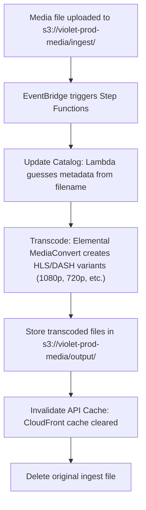
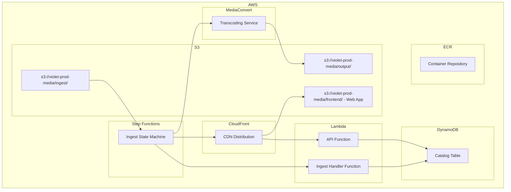

# Architecture

## Ingest Process

```mermaid
flowchart TD
    A[Media file uploaded to s3://violet-prod-media/ingest/] --> B[EventBridge triggers Step Functions]
    B --> C[Update Catalog: Lambda guesses metadata from filename]
    C --> D["Transcode: Elemental MediaConvert creates HLS/DASH variants (1080p, 720p, etc.)"]
    D --> E[Store transcoded files in s3://violet-prod-media/output/]
    E --> F[Invalidate API Cache: CloudFront cache cleared]
    F --> G[Delete original ingest file]
```

## General Infrastructure

```mermaid
flowchart TD
    subgraph AWS
        subgraph S3
            A[s3://violet-prod-media/ingest/]
            B[s3://violet-prod-media/output/]
            J[s3://violet-prod-media/frontend/ - Web App]
        end
        subgraph Lambda
            C[API Function]
            D[Ingest Handler Function]
        end
        subgraph Step Functions
            E[Ingest State Machine]
        end
        subgraph MediaConvert
            F[Transcoding Service]
        end
        subgraph CloudFront
            G[CDN Distribution]
        end
        subgraph DynamoDB
            H[Catalog Table]
        end
        subgraph ECR
            I[Container Repository]
        end
    end
    A --> E
    E --> D
    D --> H
    E --> F
    F --> B
    E --> G
    C --> H
    G --> J
    G --> C
```
