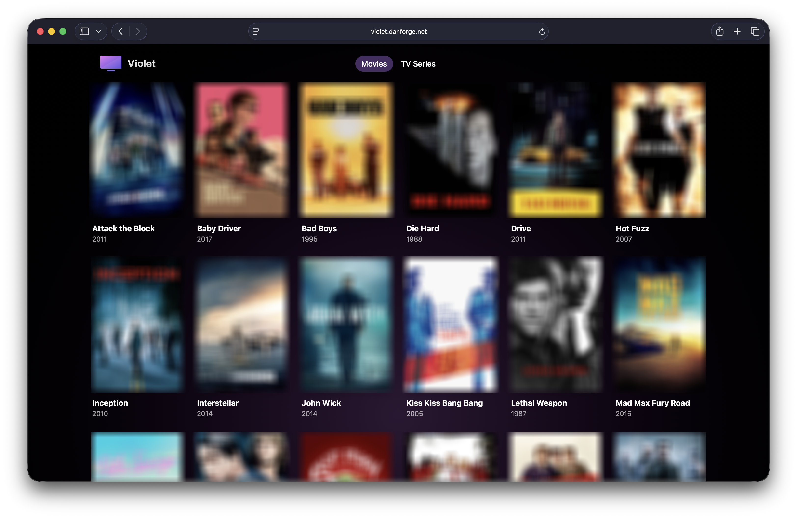

# Violet

A cloud-native media hosting solution for your movies and TV shows.

Violet has been a pet project of mine for the past five years, and I usually only work on it over Christmas, so progress has been pretty slow. Since it mainly exists as a way to experiment with different technologies, it’s gone through multiple rewrites in Golang, React, Angular, C# (Xbox UWP), AWS CDK, Terraform, and probably a few others I’ve forgotten.

## Features

- Metadata extraction from filenames, e.g. `Hot Fuzz (2007)` or `Frasier (1999) - S01E01 - The Good Son`.

- Automatic download of posters and stills from [The MovieDB](https://www.themoviedb.org).

- Automatic transcode of media into HLS and MPEG-DASH into 1080p, 720p, 540p and 360p.

- Serverless, although Elemental MediaConvert is quite spendy.

- A pretty web frontend.

## Architecture

See [ARCHITECTURE.md](docs/ARCHITECTURE.md) for detailed diagrams.

## Developing

### Prerequisites

- Python 3.14
- Node.js 24
- OpenTofu 1.11.5+

### Getting Started

1. `python3 -m venv venv`
2. `source venv/bin/activate`
3. `pip install -r dev-requirements.txt`
4. `pip install pre-commit`
5. `pre-commit install --install-hooks`
6. `cd applications/web_app && npm install && cd ../..`

### Building and Pushing Application Images

1. `export AWS_PROFILE=...`
2. `export AWS_DEFAULT_REGION=eu-west-2`
3. `invoke build-and-push-images --environment-name prod`

### Building and Deploying the Frontend

1. `export AWS_PROFILE=...`
2. `export AWS_DEFAULT_REGION=eu-west-2`
3. `invoke build-and-deploy-frontend --environment-name prod`

## Deploying

If you want to deploy Violet into your own AWS account, just know I don't provide any support.

With that said, you'll need the following:

- An API key for [The MovieDB](https://www.themoviedb.org) used for artwork collection.

- An AWS CLI profile named `admin`.

- An AWS Secret in `eu-west-2` named `/violet/prod/data_providers` with a JSON key named `THE_MOVIE_DB_API_KEY`.
